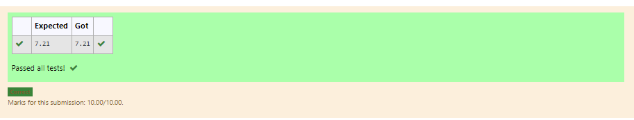

# DISTANCE-BETWEEN-TWO-POINTS

## AIM:
To write a python program to find the distance two 2 points
## ALGORITHM:
### Step 1: 
Get the two values from the user
### Step 2: 
Assign the value of second variable to a temporary variable
### Step 3: 
Substitute the values in the distance formula  
### Step 4: 
Print the values.
### Step 5:  
End the program
### PROGRAM:
~~~
#Program to find the distance between two points.
#Developed by: Dharani.E
#RegisterNumber:21500555
import math 
x=[10,6]
y=[4,2]
value=math.sqrt((10-4)**2+(6-2)**2)
print("{:.2f}".format(value))
~~~
  
### OUTPUT:

### RESULT:
Thus the distance between two points are successfully executed
